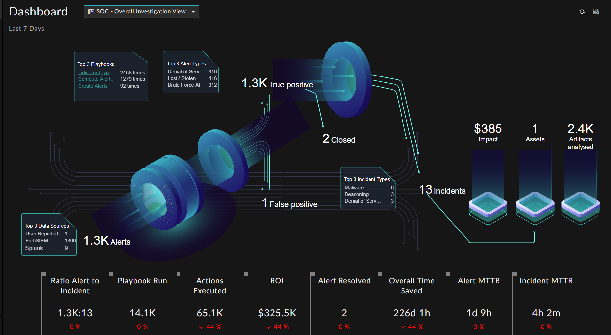

# Release Information

* **Version**: 1.0.2
* **Certified**: Yes
* **Publisher**: Fortinet
* **Compatible Version**: FortiSOAR v7.2.2 and later
- [Release Notes](./release_notes.md)

# Overview

The **SOC Overview Metrics** solution pack creates a dashboard using information from the SOC Management Widget. The available customizations and filters ensure focus on relevant information by removing the noise.

At a glance you can view the overall picture of the investigations carried out by a SOC analyst in a specified time frame.

Following is an example of the Dashboard with Demo records

Information such as the following can be viewed:

- Alert related information such as:

    - Count of alerts created
    - Type of alerts created
    - Count of alerts closed
    - Count of alerts categorized as *False Positive*
    - Count of alerts categorized as *True Positive*

- Incident related information such as:

    - Top three incident types
    - Their associated assets
    - Analyzed artifacts.

- Other important information such as:

    - Top three playbooks
    - Data sources
    - Alert types
    - ROI (Return on Investment)
    - Playbooks executed, and also some information about the incidents including the 

# Next Steps

| [Installation](./docs/setup.md#installation) | [Configuration](./docs/setup.md#configuration) | [Usage](./docs/usage.md) | [Contents](./docs/contents.md) |
|----------------------------------------------|------------------------------------------------|--------------------------|--------------------------------|
