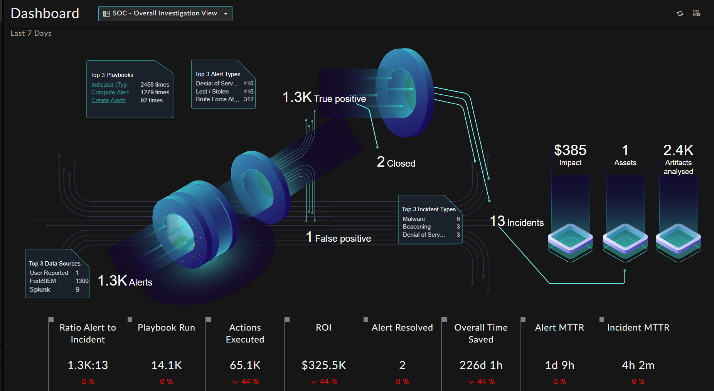

| [Home](https://github.com/fortinet-fortisoar/solution-pack-soc-overview/blob/release/1.0.0/README.md) |
|--------------------------------------------|

# Usage

- Navigate to the newly created dashboard **SOC Overview**. 
- The Dashboard provides an overall view of an investigation scenario in a SOC. 

- Below is an example of the Dashboard with Demo records

    

## Customize
- Refer to the [SOC Management Widget](https://github.com/fortinet-fortisoar/widget-soc-management/blob/release/1.0.0/README.md) documentation to change the parameters according to your needs.

- Change the 'Where' field and last 'x' days field to view the dashboard for the desired timeframe.